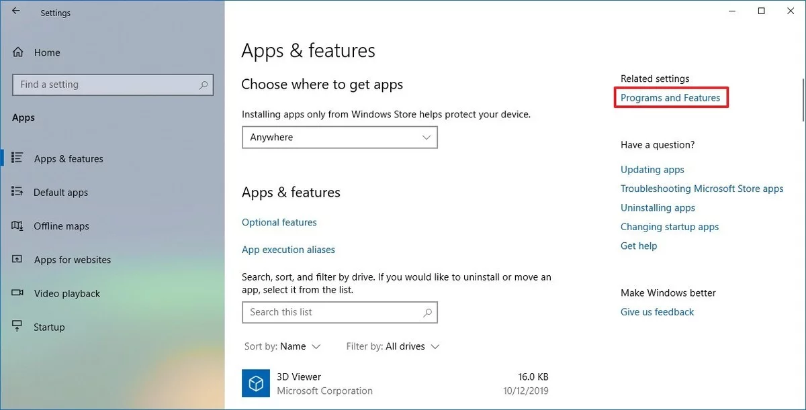
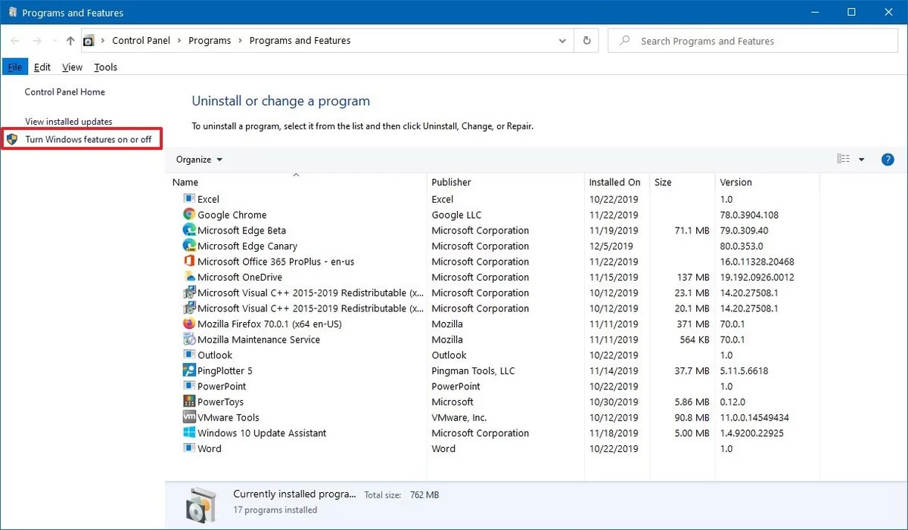

# Install Instructions

Here are a few basic tools we will be using. Download and/or register for each of these services.

## Download and Install
* [Chrome](https://www.google.com/chrome/)
* [Slack](https://slack.com/downloads)
* [iTerm2](https://www.iterm2.com/downloads.html) (for OS X) or [Hyper](https://hyper.is) (for Windows 10)
* [VS Code](https://code.visualstudio.com/Download)

## Register an account
* Slack (you should have received an invite)
* [GitHub](https://github.com/join?ref_cta=Sign+up&ref_loc=header+logged+out&ref_page=%2F&source=header-home)

## For Mac Users Only

Normally you **NEVER** want to run random commands that you get from the internet in your terminal without understanding what they are and exactly what they do. The terminal could give anyone full access to your entire computer. In this case these commands are coming from a trusted source (me) so it's okay.

Run this command in your terminal to install [Homebrew](https://brew.sh/).

`/bin/bash -c "$(curl -fsSL https://raw.githubusercontent.com/Homebrew/install/master/install.sh)"`

## For Windows Users Only

> Follow these steps to enable "Windows Subsytem Linux" so you can use the same command line environment as mac users.

1. Open Settings.
2. Click on Apps.
    
3. Under the "Related settings" section, click the Programs and Features option.
4. Click the Turn Windows features on or off option from the left pane.
    
5. Check the Windows Subsystem for Linux option.
    
6. Click the OK button.
7. Click the Restart now button.
8. After your computer restarts, install [Ubuntu from the Microsoft Store](https://www.microsoft.com/en-us/p/ubuntu/9nblggh4msv6?irgwc=1&OCID=AID2000142_aff_7593_159229&tduid=%28ir__61iffalgm0kftxpwxkqdydtlre2xneyigakslxxg00%29%287593%29%28159229%29%28%29%28UUwpUdUnU72700YYwYg%29&irclickid=_61iffalgm0kftxpwxkqdydtlre2xneyigakslxxg00&activetab=pivot:overviewtab). **Be sure to write down the username and password that you choose when going through this installation process.**
9. Open Hyper Term that you downloaded above.
10. Press `ctrl ,` and find the following lines:
    ```
        // the shell to run when spawning a new session (i.e. /usr/local/bin/fish)
        // if left empty, your system's login shell will be used by default
        // make sure to use a full path if the binary name doesn't work
        // (e.g `C:\\Windows\\System32\\bash.exe` instad of just `bash.exe`)
        // if you're using powershell, make sure to remove the `--login` below
        shell: '',
    ```
11. Replace the last line with `shell: 'C:\\Windows\\System32\\bash.exe'`
12. Save and close the file. Close Hyper term and re-open.
13. Type `ls`. You should not see an error.