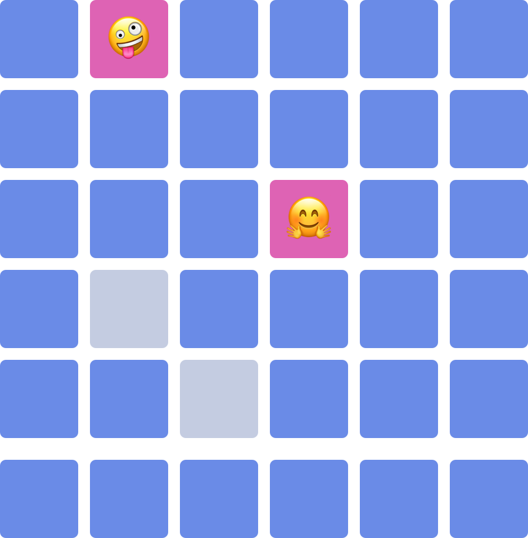
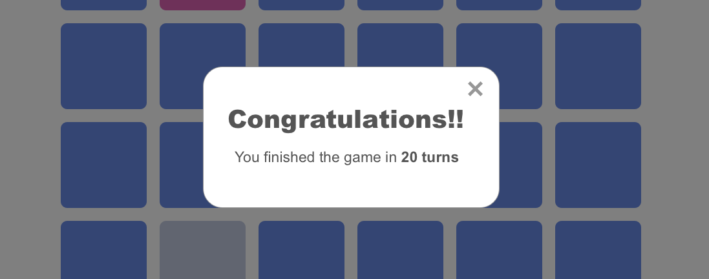

# JavaScript Concentration Game

## Description

Concentration, also known as Match Match, Match Up, Memory, Pelmanism, Shinkei-suijaku, Pexeso or simply Pairs, is a card game in which all of the cards are laid face down on a surface and two cards are flipped face up over each turn. The object of the game is to turn over pairs of matching cards.

## Objectives

After completing this assignment, you should…

- be able to target and style elements JavaScript
- be able to respond to click events on DOM elements

## Assignment

Using HTML, CSS and JavaScript, build a single player game of concentration. The game should be represented by a 6 x 6 grid of squares. Each square should have one of 18 potential hidden [emoji icon](https://getemoji.com/) and each turn the player should be able to click two squares to reveal the emoji icons for those squares.

- If the icons are identical then the squares should grey out and not be clickable anymore.
- If the icons are different then the squares should hide the emoji icons after 1.5 seconds.

The game should display a count of the total number of turns that the player has taken so far.

## CSS Bonus

1. Use [CSS 3D Transforms](https://3dtransforms.desandro.com/card-flip) to animate your cards so that they look like they are flipping over when a user clicks on them.
1. When the game is over show a [modal overlay](https://hackernoon.com/the-ultimate-guide-for-creating-a-simple-modal-component-in-vanilla-javascript-react-angular-8733e2859b42) on top of the game with a congratulatory message and an `X` button that you can use to close the overlay.
   

## JS Bonus

1. Add buttons to your game that can be clicked at any time to start a new game from scratch without refreshing the page.
1. Update your game to support two players who alternate turns. Show the number of pairs that each player has gotten as well as whose turn it currently is.
1. Use `<input type="number" />` elements to allow the player to pick how many rows and columns the game should have. Hint: you may find [appendChild](https://developer.mozilla.org/en-US/docs/Web/API/Node/appendChild) to be useful.

## Notes

- [addEventListener](https://developer.mozilla.org/en-US/docs/Web/API/EventTarget/addEventListener)
- [removeEventListener](https://developer.mozilla.org/en-US/docs/Web/API/EventTarget/removeEventListener)
- [emoji icons](https://getemoji.com/)
