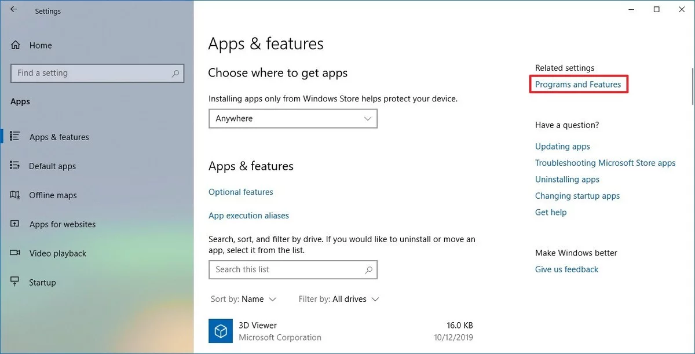
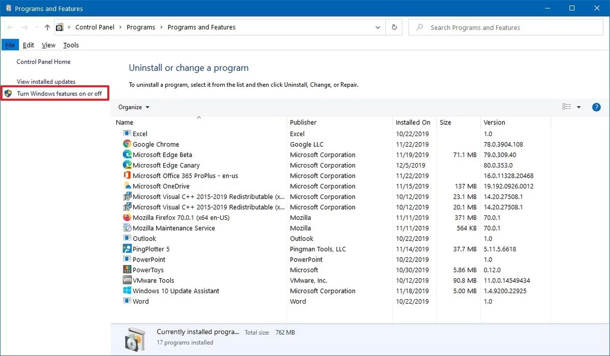

# Windows 10 Specific Installation

1. Open Settings.
2. Click on Apps.
    
3. Under the "Related settings" section, click the Programs and Features option.
4. Click the Turn Windows features on or off option from the left pane.
    
5. Check the Windows Subsystem for Linux option.
    
6. Click the OK button.
7. Click the Restart now button.
8. After your computer restarts, install [Ubuntu from the Microsoft Store](https://www.microsoft.com/en-us/p/ubuntu/9nblggh4msv6?irgwc=1&OCID=AID2000142_aff_7593_159229&tduid=%28ir__61iffalgm0kftxpwxkqdydtlre2xneyigakslxxg00%29%287593%29%28159229%29%28%29%28UUwpUdUnU72700YYwYg%29&irclickid=_61iffalgm0kftxpwxkqdydtlre2xneyigakslxxg00&activetab=pivot:overviewtab). **Be sure to write down the username and password that you choose when going through this installation process.**
9. Open Hyper Term that you downloaded above.
10. Press `ctrl ,` and find the following lines:
    ```
        // the shell to run when spawning a new session (i.e. /usr/local/bin/fish)
        // if left empty, your system's login shell will be used by default
        // make sure to use a full path if the binary name doesn't work
        // (e.g `C:\\Windows\\System32\\bash.exe` instad of just `bash.exe`)
        // if you're using powershell, make sure to remove the `--login` below
        shell: '',
    ```
11. Replace the last line with `shell: 'C:\\Windows\\System32\\wsl.exe'`
12. Replace the line that start with shellArgs to look like this:`shellArgs: [],`
13. Save and close the file. Close Hyper term and re-open.
14. Type `ls`. You should not see an error.

### git

Git comes already installed with most of the Windows Subsystem for Linux distributions, however, you may want to update to the latest version.

Confirm that you have git. 

Type: `git --version` into the command line. 

In response you should see “git version” followed by a number. As of 6/18/22 the latest version of git is 2.36.1. 

If you get an error you will have to download git with the following command: 

`sudo apt-get install git`

If git is not the latest version, update git. As follows: 

#### Add git-core PPA
Ubuntu's default package repository often doesn't package a new version of Git for users.

To fix this, you'll need to add a PPA (Personal Package Archive), maintained by the Git team for Ubuntu users. Begin by adding the PPA:

`sudo add-apt-repository ppa:git-core/ppa`

Once you've added the git-core PPA, you can update your repository cache, and install Git from the new source:

```
sudo apt-get update
sudo apt-get install git
```


<!-- Then run in the terminal: `git config --global credential.helper ????????` -->